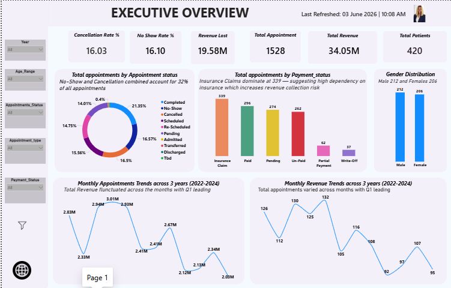
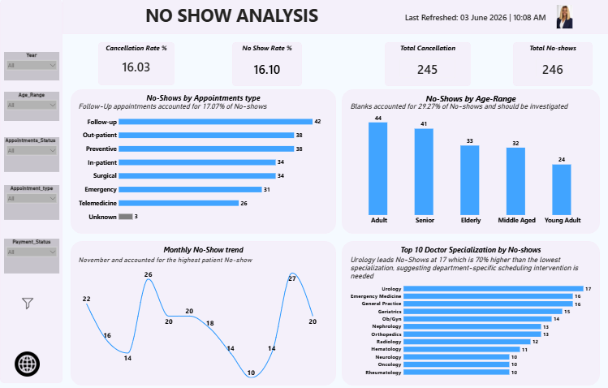
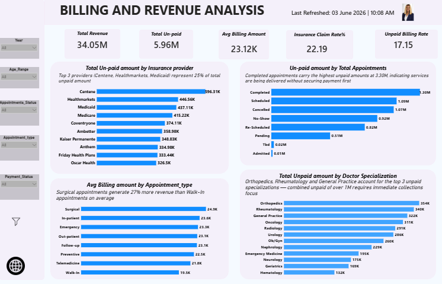

# 🏥 Healthcare Analytics Pipeline
### End-to-End Data Project: Excel → Azure SQL → Power BI


---

## 📌 Project Overview

This project presents a complete end-to-end healthcare data analytics pipeline built to address a real business problem:

> **"Appointment No-Shows and Unpaid Billing are Costing Healthcare Providers Significant Revenue"**

Starting from raw, messy data and ending with a cloud-connected Power BI dashboard, every step of this project was built and executed manually to ensure a deep understanding of the full data analytics workflow before automation is introduced.

---

## 🎯 Business Problem

Healthcare providers face two critical operational challenges:

- **No-Shows and Cancellations** account for 32% of all appointments — meaning nearly 1 in 3 appointments never generates revenue
- **Unpaid Billing** puts 19.58M (57% of total revenue) at risk across Un-Paid, Pending, Write-Off and Partial Payment statuses

This analysis identifies the root causes, patterns and actionable recommendations to drive operational and financial improvement.

---

## 🗂️ Project Structure

```
healthcare-analytics-pipeline/
│
├── data/
│   ├── raw/                        # Original uncleaned dataset
│   └── cleaned/                    # Cleaned dataset after Power Query
│
├── powerquery/
│   └── cleaning_steps.md           # Documented Power Query steps
│
├── sql/
│   ├── create_table.sql            # Azure SQL table creation
│   └── validation_queries.sql      # Row count and data checks
│
├── powerbi/
│   └── healthcare_dashboard.pbix   # Power BI dashboard file
│
├── screenshots/
│   ├── executive_overview.png
│   ├── noshow_analysis.png
│   └── billing_analysis.png
│
└── README.md
```

---

## 🔧 Tools & Technologies

| Tool | Purpose |
|---|---|
| **Microsoft Excel** | Raw data storage and Power Query automation |
| **Power Query (Excel)** | Data cleaning and transformation |
| **Azure SQL Database** | Cloud data storage (Free Tier) |
| **SQL Server Management Studio (SSMS)** | Database management and querying |
| **Microsoft Power BI Desktop** | Dashboard and visualization |
| **Azure Portal** | Cloud database management |

---

## 🔄 Pipeline Architecture

```
Raw Excel Data (1,528 records)
        ↓
Power Query — Automated Cleaning & Transformation
        ↓
Azure SQL Database — Cloud Storage (vivian6425.database.windows.net)
        ↓
Power BI Desktop — Connected via Azure SQL
        ↓
3-Page Interactive Dashboard
```

---

## 🧹 Stage 1: Data Cleaning (Excel Power Query)

The dataset contained significant quality issues requiring systematic cleaning across multiple dimensions.

### Cleaning Steps Applied:

| # | Step | Detail |
|---|---|---|
| 1 | **Removed Duplicates** | Used Appointment_ID as unique identifier |
| 2 | **Standardized Dates** | Fixed multiple date formats; removed erroneous entries like "1814" using conditional columns |
| 3 | **Fixed Appointment Time** | Converted to proper time format |
| 4 | **Built Mapping Tables** | Resolved inconsistent categorical values — "Schedueld", "Canceld" etc |
| 5 | **Handled NULL Patient IDs** | Retained 10 NULL records that had valid Appointment_IDs — flagged for data team review |
| 6 | **Cleaned Text Columns** | Trimmed and standardized to remove hidden spaces and formatting errors |
| 7 | **Retained Negative Billing** | Kept negative billing amounts for finance investigation — attached to insurance claims and valid payment statuses |
| 8 | **Created Age Columns** | Built Age and Age Range columns for demographic analysis |
| 9 | **Replaced Small Blanks** | Replaced blanks in low-impact columns (4 rows or fewer) with "Unspecified" |
| 10 | **Replaced Invalid Entries** | Replaced N/A, NA, ???, ? with "Unspecified" |

### Automation Test:
The dataset was intentionally divided into two halves. After cleaning the first half, the second half was appended to the source sheet and Power Query was refreshed — **every cleaning step applied automatically** confirming a robust and repeatable pipeline.

---

## ⚙️ Stage 2: Cloud Storage (Azure SQL)

### Database Details:
- **Server:** vivian6425.database.windows.net
- **Database:** free-sql-db-2890620
- **Tier:** Azure Free Tier
- **Location:** South Africa North

### Validation Query:
```sql
SELECT COUNT(*) FROM [New healthcare]
```
Row count confirmed to match cleaned Excel dataset.

### Sample Query — Monthly Trend Analysis:
```sql
SELECT 
    YEAR(App_Date) AS Year,
    DATENAME(MONTH, App_Date) AS Month_Name,
    MONTH(App_Date) AS Month_Number,
    COUNT(appointment_id) AS Total_Appointments,
    SUM(CASE WHEN Appointment_Status = 'No-show' 
        THEN 1 ELSE 0 END) AS No_Shows,
    SUM(CASE WHEN Billing_Amount > 0 
        THEN Billing_Amount ELSE 0 END) AS Total_Revenue
FROM [New healthcare]
WHERE App_Date IS NOT NULL
GROUP BY 
    YEAR(App_Date),
    MONTH(App_Date),
    DATENAME(MONTH, App_Date)
ORDER BY Year, MONTH(App_Date)
```

---

## 📊 Stage 3: Power BI Dashboard

The dashboard is structured across 3 analytical pages plus a recommendations page.

---

### Page 1 — Executive Overview

**KPIs:**
| Metric | Value |
|---|---|
| Total Appointments | 1,528 |
| Total Patients | 420 |
| Total Revenue | 34.05M |
| Revenue Lost | 19.58M |
| No-Show Rate | 16.10% |
| Cancellation Rate | 16.03% |

**Charts:**
- Appointment Status Distribution (Donut Chart)
- Payment Status Distribution (Bar Chart)
- Gender Distribution
- Monthly Appointments Trend (Line Chart)
- Monthly Revenue Trend (Line Chart)

---

### Page 2 — No-Show Analysis

**KPIs:**
- No-Show Rate: 16.10%
- Cancellation Rate: 16.03%
- Total No-Shows: 246
- Total Cancellations: 245

**Charts:**
- No-Shows by Appointment Type
- No-Shows by Age Range
- Monthly No-Show Trend
- Top 10 Doctor Specialization by No-Shows

---

### Page 3 — Billing & Revenue Analysis

**KPIs:**
- Total Revenue: 34.05M
- Total Unpaid: 5.96M
- Avg Billing Amount: 23.12K
- Insurance Claim Rate: 22.19%
- Unpaid Billing Rate: 17.15%

**Charts:**
- Total Unpaid by Insurance Provider
- Unpaid Amount by Appointment Status
- Avg Billing by Appointment Type
- Total Unpaid by Doctor Specialization

---

### Page 4 — Insights & Recommendations

---

## 🔍 Key Insights

**1. Revenue at Critical Risk**
19.58M — 57% of total revenue is at risk across unpaid, pending and write-off statuses. Completed appointments alone carry 3.30M in unpaid billing meaning services are being delivered without securing payment first.

**2. No-Shows and Cancellations Are Costing the Business**
32% of all 1,528 appointments were either No-Shows or Cancellations. Follow-up appointments drive the highest no-show rate at 17.07% while November consistently records the peak at 27 cases.

**3. Insurance Dependency is a Collection Risk**
Insurance Claims dominate payment status at 339 records. Centene alone accounts for 596K in unpaid billing with the top 3 providers representing 25% of total unpaid amounts.

**4. Three Departments Carry Over 1M in Unpaid Billing**
Orthopedics 354K, Rheumatology 340K and General Practice 322K combined exceed 1M in outstanding unpaid amounts requiring immediate departmental focus.

**5. Data Quality is Limiting Analysis**
29.27% of no-show records have missing age data and unclassified records exist across appointment types and payment statuses limiting the accuracy of demographic and financial analysis.

---

## ✅ Recommendations

**1. Collect Payment at Check-In**
Shift to a payment-first policy before services are rendered — directly addressing the 3.30M unpaid completed appointments.

**2. Automate Appointment Reminders**
Deploy SMS and email reminders 48 and 24 hours before appointments — prioritising Follow-up and Urology which show the highest no-show rates.

**3. Escalate Insurance Collections Immediately**
Contact Centene, Healthmarkets and Medicaid within 5 business days for all claims older than 45 days — over 1.5M combined at stake.

**4. Assign Dedicated Billing Staff to High-Risk Departments**
Orthopedics, Rheumatology and General Practice require dedicated billing coordinators to recover the 1M+ outstanding balance.

**5. Enforce Mandatory Data Capture at Registration**
Implement a data governance policy targeting zero unclassified records and age capture above 95% within 90 days.

---

## 💡 Key Technical Decisions & Reasoning

| Decision | Reasoning |
|---|---|
| Retained NULL Patient IDs | Records had valid Appointment IDs — deleting would lose real appointment data |
| Kept Negative Billing Amounts | Attached to Insurance Claims and valid payment statuses — likely refunds not errors |
| Used NULL for Missing Dates | Imputing unknown dates would fabricate data and corrupt trend analysis |
| Replaced Blood Group blanks with Unknown | Acceptable placeholder — does not affect analysis integrity |
| Used Days Outstanding per invoice | Each invoice uses its own due date — not a global reference — for accuracy |
| Used DIVIDE in DAX not division operator | Prevents divide-by-zero errors in rate calculations |

---

## 📁 DAX Measures Used

```dax
-- No Show Rate
No Show Rate = 
DIVIDE(
    CALCULATE(COUNT('New healthcare'[appointment_id]),
    'New healthcare'[Appointment_Status] = "No-show"),
    COUNT('New healthcare'[appointment_id]),
    0
) * 100

-- Total Revenue (Positive billing only)
Total Revenue = 
CALCULATE(
    SUM('New healthcare'[Billing_Amount]),
    'New healthcare'[Billing_Amount] > 0
)

-- Revenue Lost
Revenue Lost = 
CALCULATE(
    SUM('New healthcare'[Billing_Amount]),
    'New healthcare'[Payment_Status] IN {
        "Un-Paid", "Pending", "Partial Payment", "Write-Off"
    }
)

-- Cancellation Rate
Cancellation Rate = 
DIVIDE(
    CALCULATE(COUNT('New healthcare'[appointment_id]),
    'New healthcare'[Appointment_Status] = "Cancelled"),
    COUNT('New healthcare'[appointment_id]),
    0
) * 100
```

---

## 📸 Dashboard Screenshots

### Executive Overview


### No-Show Analysis


### Billing & Revenue Analysis


---

## 🚀 How to Use This Project

**To view the dashboard:**
1. Download `healthcare_dashboard.pbix` from the powerbi folder
2. Open in Power BI Desktop
3. Data is embedded — no Azure connection required for viewing

**To connect to live Azure SQL data:**
1. Open Power BI Desktop
2. Transform Data → Data Source Settings
3. Update server to: `vivian6425.database.windows.net`
4. Enter credentials and refresh

**To run SQL queries:**
1. Connect SSMS to `vivian6425.database.windows.net`
2. Use SQL Server Authentication
3. Select database `free-sql-db-2890620`
4. Run queries from the `/sql` folder

---

## 🔜 Future Enhancements

- [ ] Power Automate integration for automated email alerts
- [ ] Scheduled Power BI refresh from Azure SQL
- [ ] Python script for automated data ingestion
- [ ] Second project: Sales Performance Tracker with Pivot Tables
- [ ] Full ETL automation removing all manual steps

---

## 👩‍💻 About

**Vivian Obinwa**
Data Analyst | Excel | SQL | Power BI | Azure

📧 Eceline493@gmail.com
🔗 LinkedIn: Obinwavivian64@gmail.com

---

## 📝 Notes

- Analysis based on 1,528 appointments across 420 unique patients
- Data covers 3 years: 2022 to 2024
- 10 Patient ID records retained as NULL — flagged for data team review
- Negative billing amounts retained for finance team investigation
- All cleaning performed manually as a learning exercise to understand every step before automation

---

*"If you can't do it manually, you can't automate it properly."*
